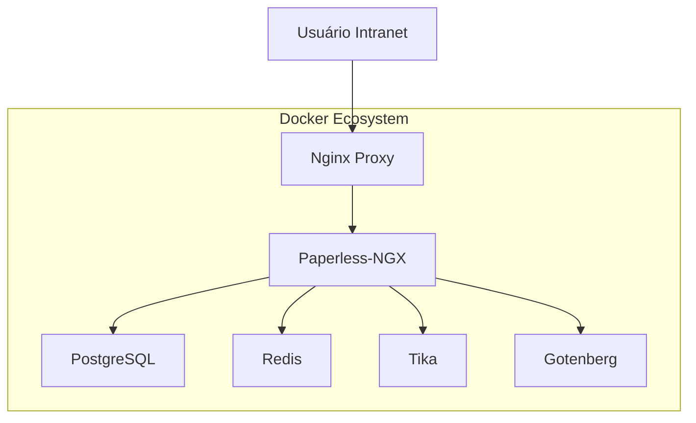

# 📋 Documentação Técnica - Paperless-NGX Integração Intranet

## 🎯 Visão Geral

Este projeto fornece uma solução completa para integração do Paperless-NGX com sistemas de intranet corporativa, permitindo gestão eletrônica de documentos de forma segura e eficiente.

## 🏗️ Arquitetura do Sistema

### Componentes Principais



### Stack Tecnológica

| Componente | Versão | Função |
|------------|--------|--------|
| **Paperless-NGX** | Latest | Sistema principal de gestão documental |
| **PostgreSQL** | 15 | Banco de dados relacional |
| **Redis** | 7 | Cache e filas de processamento |
| **Nginx** | Alpine | Proxy reverso e balanceador |
| **Apache Tika** | Latest | Extração de texto e metadados |
| **Gotenberg** | 7 | Conversão de documentos |
| **Docker** | 20+ | Containerização |

## 🚀 Instalação e Configuração

### Pré-requisitos

- Docker Engine 20.10+
- Docker Compose 2.0+
- 4GB RAM mínimo
- 20GB espaço em disco
- Portas 80, 443, 8000 disponíveis

### Instalação Rápida

```bash
# 1. Clone o repositório
git clone https://github.com/ailtondba/integracao-intranet.git
cd integracao-intranet

# 2. Configure as variáveis de ambiente
cp docker-compose.env.example docker-compose.env
nano docker-compose.env

# 3. Inicie os serviços
docker-compose up -d

# 4. Verifique o status
docker-compose ps
```

### Configuração Detalhada

#### 1. Variáveis de Ambiente Críticas

```bash
# Segurança
PAPERLESS_SECRET_KEY="sua-chave-secreta-muito-longa-e-aleatoria"
PAPERLESS_ALLOWED_HOSTS="seu-dominio.com,localhost"

# Banco de dados
PAPERLESS_DBPASS="senha-segura-do-banco"

# Usuário admin
PAPERLESS_ADMIN_USER="admin"
PAPERLESS_ADMIN_PASSWORD="senha-admin-segura"
```

#### 2. Configuração CORS

```bash
# Para integração com intranet
PAPERLESS_CORS_ALLOWED_HOSTS="https://intranet.empresa.com,http://localhost:3000"
```

#### 3. SSL/TLS (Produção)

```bash
# Gerar certificados SSL
openssl req -x509 -nodes -days 365 -newkey rsa:2048 \
  -keyout nginx/ssl/paperless.key \
  -out nginx/ssl/paperless.crt
```

## 🔧 Configuração da API

### Obtenção do Token de API

1. Acesse o Paperless-NGX: `http://localhost:8000`
2. Faça login com credenciais admin
3. Vá em **Settings** → **API Tokens**
4. Clique em **Create Token**
5. Copie o token gerado

### Exemplo de Uso da API

```javascript
// Configuração básica
const API_URL = 'http://localhost:8000/api';
const API_TOKEN = 'seu-token-aqui';

// Headers padrão
const headers = {
    'Authorization': `Token ${API_TOKEN}`,
    'Content-Type': 'application/json'
};

// Buscar documentos
fetch(`${API_URL}/documents/?query=contrato`, { headers })
    .then(response => response.json())
    .then(data => console.log(data));
```

## 🔒 Segurança

### Configurações de Segurança

#### 1. Firewall
```bash
# Permitir apenas portas necessárias
sudo ufw allow 80/tcp
sudo ufw allow 443/tcp
sudo ufw deny 8000/tcp  # Bloquear acesso direto
```

#### 2. Headers de Segurança (Nginx)
```nginx
add_header X-Frame-Options SAMEORIGIN;
add_header X-Content-Type-Options nosniff;
add_header X-XSS-Protection "1; mode=block";
add_header Strict-Transport-Security "max-age=31536000";
```

#### 3. Backup Automático
```bash
# Script de backup diário
#!/bin/bash
DATE=$(date +%Y%m%d_%H%M%S)
docker-compose exec -T db pg_dump -U paperless paperless > backup_${DATE}.sql
tar -czf backup_${DATE}.tar.gz backup_${DATE}.sql data/ media/
```

## 📊 Monitoramento

### Health Checks

```bash
# Verificar status dos containers
docker-compose ps

# Logs em tempo real
docker-compose logs -f webserver

# Health check via API
curl -H "Authorization: Token seu-token" http://localhost:8000/api/
```

### Métricas Importantes

- **CPU**: < 70% em operação normal
- **RAM**: ~2GB para 10k documentos
- **Disco**: Crescimento ~100MB/1000 docs
- **Response Time**: < 2s para buscas

## 🔧 Troubleshooting

### Problemas Comuns

#### 1. Erro de CORS
```bash
# Verificar configuração CORS
docker-compose logs webserver | grep CORS

# Solução: Ajustar PAPERLESS_CORS_ALLOWED_HOSTS
```

#### 2. Banco de Dados não Conecta
```bash
# Verificar status do PostgreSQL
docker-compose exec db pg_isready -U paperless

# Resetar banco (CUIDADO!)
docker-compose down -v
docker-compose up -d
```

#### 3. OCR não Funciona
```bash
# Verificar Tika
curl http://localhost:9998/tika

# Logs do Tika
docker-compose logs tika
```

### Comandos Úteis

```bash
# Backup completo
docker-compose exec webserver python manage.py document_exporter /export

# Reindexar documentos
docker-compose exec webserver python manage.py document_index reindex

# Limpar cache
docker-compose exec redis redis-cli FLUSHALL

# Atualizar containers
docker-compose pull
docker-compose up -d
```

## 📈 Performance

### Otimizações Recomendadas

#### 1. PostgreSQL
```sql
-- Configurações de performance
ALTER SYSTEM SET shared_buffers = '256MB';
ALTER SYSTEM SET effective_cache_size = '1GB';
ALTER SYSTEM SET maintenance_work_mem = '64MB';
```

#### 2. Redis
```bash
# Configurar persistência
echo "save 900 1" >> redis.conf
echo "save 300 10" >> redis.conf
```

#### 3. Nginx
```nginx
# Cache de arquivos estáticos
location ~* \.(jpg|jpeg|png|gif|ico|css|js)$ {
    expires 1y;
    add_header Cache-Control "public, immutable";
}
```

## 🔄 Integração com Intranet

### Exemplo de Widget HTML

```html
<!-- Widget de busca para intranet -->
<div id="paperless-widget">
    <input type="text" id="search-docs" placeholder="Buscar documentos...">
    <div id="results"></div>
</div>

<script>
// Implementação da busca
function searchDocuments(query) {
    fetch(`${PAPERLESS_API}/documents/?query=${query}`, {
        headers: { 'Authorization': `Token ${API_TOKEN}` }
    })
    .then(response => response.json())
    .then(data => displayResults(data.results));
}
</script>
```

### Iframe Seguro

```html
<!-- Embed seguro do Paperless -->
<iframe 
    src="https://paperless.empresa.com" 
    sandbox="allow-same-origin allow-scripts allow-forms"
    style="width: 100%; height: 600px; border: none;">
</iframe>
```

## 📚 Recursos Adicionais

### Links Úteis

- [Documentação Oficial Paperless-NGX](https://paperless-ngx.readthedocs.io/)
- [API Reference](https://paperless-ngx.readthedocs.io/en/latest/api.html)
- [Docker Hub](https://hub.docker.com/r/paperlessngx/paperless-ngx)
- [GitHub Issues](https://github.com/paperless-ngx/paperless-ngx/issues)

### Comunidade

- [Discord](https://discord.gg/paperless)
- [Reddit](https://reddit.com/r/paperless)
- [Matrix](https://matrix.to/#/#paperless:matrix.org)

---

## 📞 Suporte

Para suporte técnico:

1. **Issues**: Abra uma issue no GitHub
2. **Documentação**: Consulte este README
3. **Logs**: Sempre inclua logs relevantes
4. **Versões**: Informe versões do Docker e sistema

---

**Desenvolvido com ❤️ para gestão documental corporativa**
